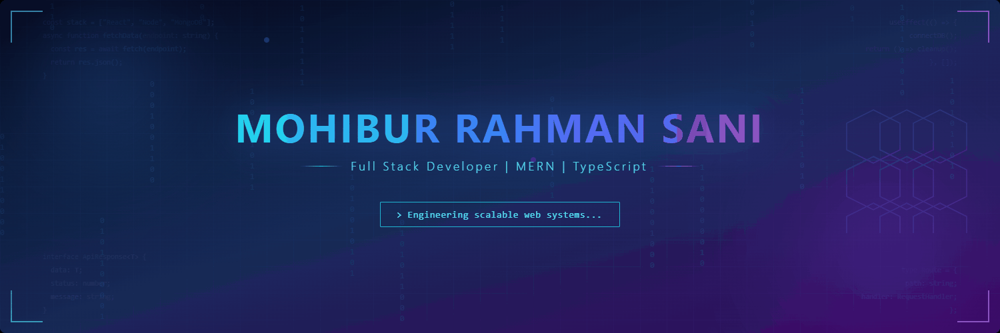

  

# Mohibur Rahman Sani

**Full Stack Developer | MERN | TypeScript**  

I build modern, scalable, and user-focused web applications. Passionate about clean architecture, performance, and maintainable code.

---

### 💻 Technologies & Skills

#### Languages

  

#### Frontend & Backend

  

#### Databases & Tools

  

---

### 📊 GitHub Summary

<!--

  

-->

---

### 🔗 Connect with Me

  
  
  
  

---

  <b><i>"Simple can be harder than complex."</i></b> – <i>Unknown</i>

